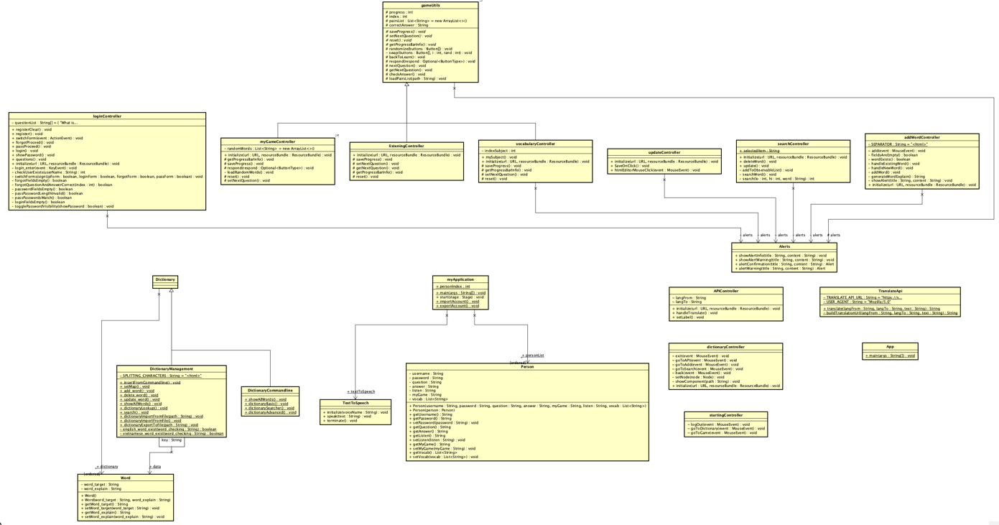

# Dictionary Application

## Contributors

- [Hoàng Thiên Trường (22021219) - K67-CC](https://github.com/truonghehe)
- [Nguyễn Ngọc Tùng (22021192) - K67-CC](https://github.com/22021192-NguyenNgocTung)
- [Nguyễn Thế Vinh (22021174) - K67-CC](https://github.com/athevinha)

## Introduction

Bài tập lớn - Từ điển, ứng dụng học tiếng anh (2324I_INT2204_1 - Lập trình hướng đối tượng).

## Features

- Thêm, sửa, xóa từ.
- Tra từ.
- Phát âm tiếng anh.
- API google translate Anh <> Việt
- Ứng dụng học tiếng anh (ghép câu, nghe, đọc).

## Class diagram:

