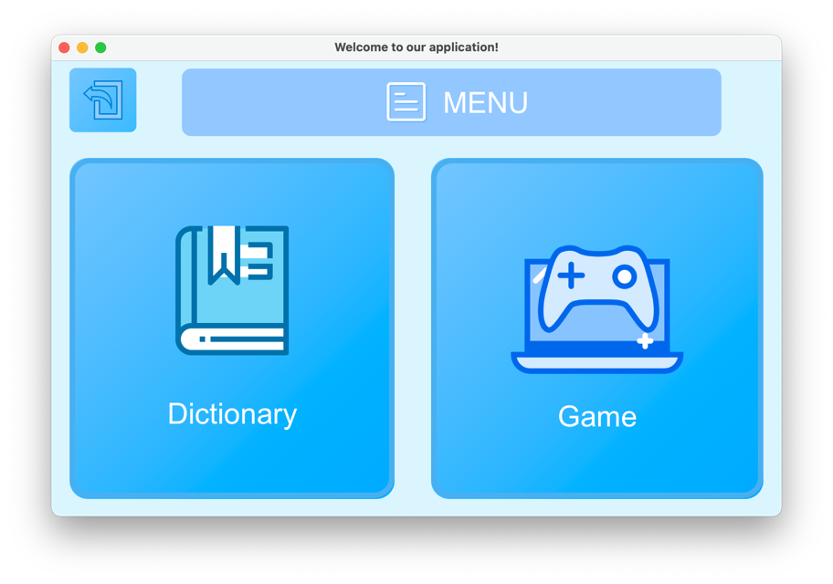
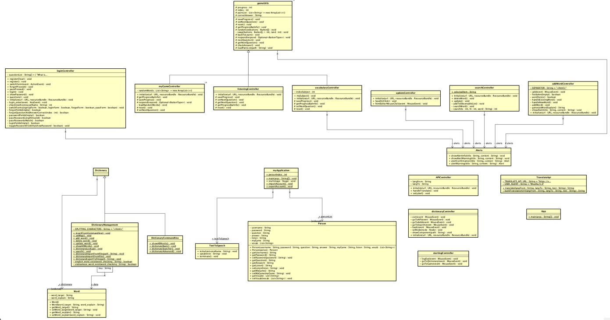

# Dictionary Learning Application

## Contributors:

- [Hoàng Thiên Trường (22021219) - K67-CC](https://github.com/truonghehe)
- [Nguyễn Ngọc Tùng (22021192) - K67-CC](https://github.com/22021192-NguyenNgocTung)
- [Nguyễn Thế Vinh (22021174) - K67-CC](https://github.com/athevinha)

## Introduction:

Bài tập lớn - Từ điển, ứng dụng học tiếng anh (2324I_INT2204_1 - Lập trình hướng đối tượng).

## Features:

- Thêm, sửa, xóa từ.
- Tra từ.
- Phát âm tiếng anh.
- API google translate Anh <> Việt.
- Ứng dụng học tiếng anh (ghép câu, nghe, đọc).

## Hướng dẫn sử dụng:
- Tạo tài khoản (nếu chưa có).
- Đăng nhập vào ứng dụng.
- Chọn Từ điển hoặc trò chơi.
- Trong từ điển:
   + Chọn tìm kiếm (hình kính lúp) để tìm kiếm từ.
     + Để tìm kiếm, di chuột vào vùng nhập từ ngữ và nhập từ cần tìm.
     + Để sửa từ đang tìm, nhấn vào sửa từ (hình bút).
     + Để xoá từ đang tìm, nhấn vào xoá từ (hình thùng rác).
     + Để nghe từ đang tìm, nhấn vào âm thanh (hình loa).
   + Chọn thêm từ (hình dấu cộng) để thêm từ mới vào từ điển:
     + Di chuột vào các vùng nhập từ ngữ và nhập thông tin với các tên tương ứng
     + Nhấn thêm từ (hình dấu cộng) để thêm từ vừa nhập.
   + Chọn dùng Google Translate (hình trái đất) để sử dụng Google Translate (phải có truy cập internet):
     + Di chuột vào các vùng nhập từ ngữ và nhập thông tin tên tương ứng
     + Nhấn tìm kiếm (Hình 2 ngôn ngữ) để tìm kiếm.
- Trong game:
    + Trò ghép câu (Word Graft): Người chơi sẽ nhận được các câu bằng Tiếng Anh và phải ghép nghĩa của các câu đó sử dụng các mảnh ghép Tiếng Việt.
    + Trò học từ vựng (Vocabulary): Người chơi sẽ chọn chủ đề mà mình muốn học. Trong trò chơi, người chơi sẽ nhận được các từ bằng Tiếng Anh và phải chọn vào ô chứa nghĩa của từ đó bằng Tiếng Việt.
    + Trò chơi nghe từ (Listening):  người chơi sẽ nhận được âm thanh của các câu bằng Tiếng Anh và phải chọn vào ô chứa nghĩa của từ đó bằng Tiếng Việt.
- Các nút trở lại (Dấu X, cánh cửa) có chức năng trở lại trang trước đó.
## Future improvements:
- Thêm nhiều ngôn ngữ cho từ điển.
- Thêm các trò chơi phức tạp.
- Tối ưu hoá thuật toán tìm kiếm.
- Dùng database để lưu trữ dữ liệu.
- thiết kế giao diện thân thiện hơn.

## Trạng thái dự án:
Đã hoàn thành.

## Demo:

## Class diagram:

